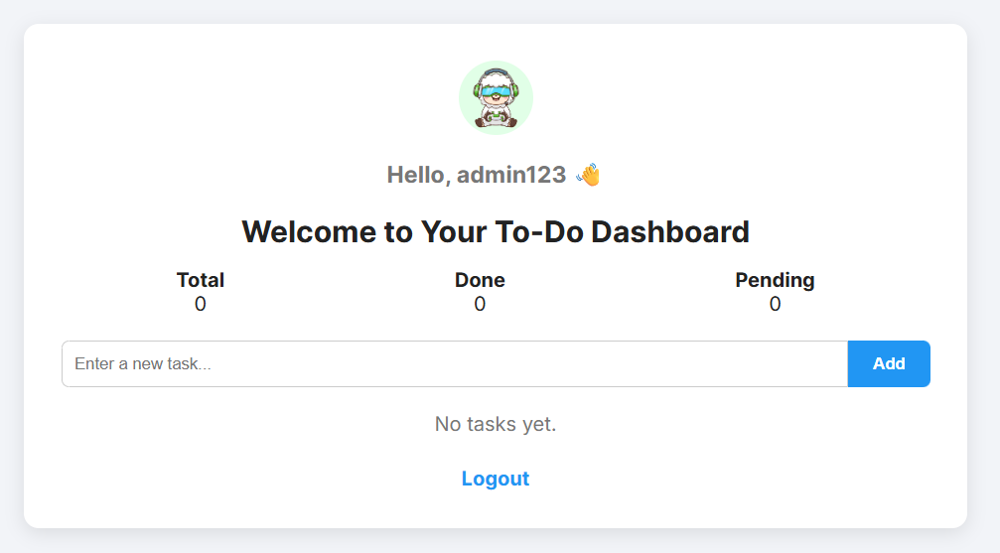
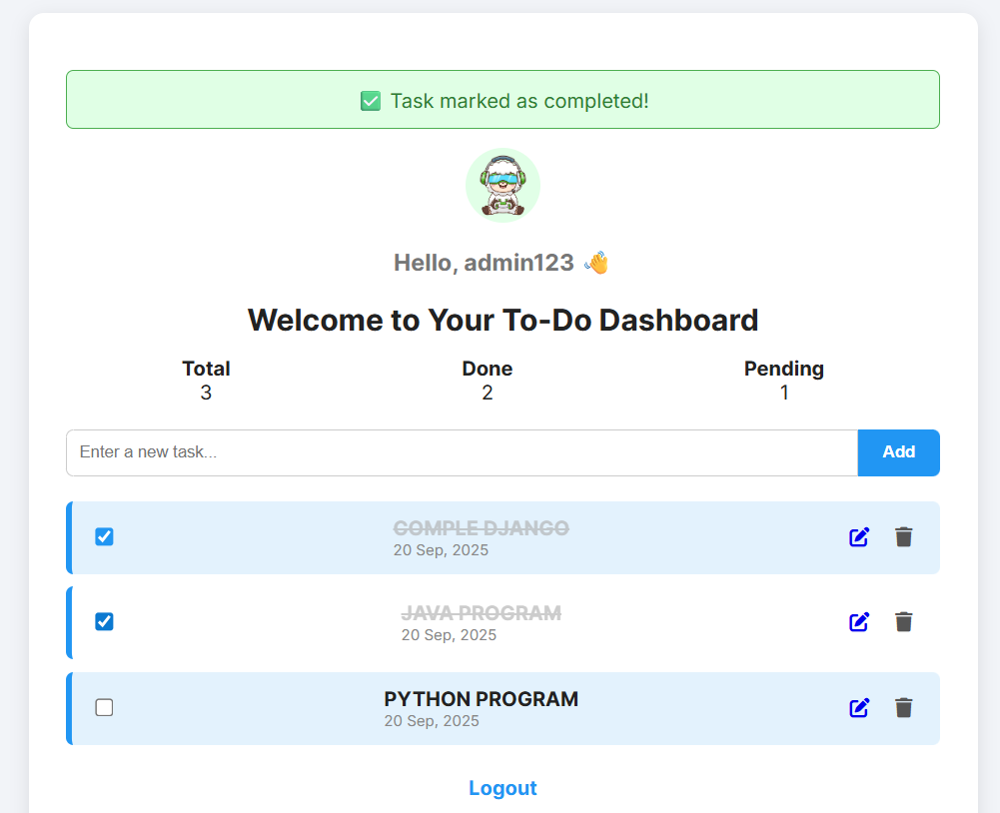
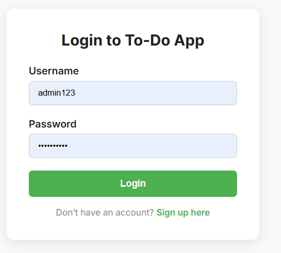

# 📝 Django To-Do Dashboard

A **modern, interactive To-Do List Dashboard** built with **Python & Django**. Manage tasks efficiently with add, edit, delete, and complete functionalities, plus a clean UI and theme-switching feature.

---

## 🔹 Features

- ✅ Add Tasks – Create new tasks easily.
- ✏️ Edit Tasks – Modify existing tasks.
- 🗑 Delete Tasks – Remove unnecessary tasks.
- ✔ Mark as Completed – Keep track of completed tasks.
- 📊 Task Statistics – View total, done, and pending tasks.
- 🎨 Theme Switching – Green, Blue, and Dark modes.
- 👤 User Authentication – Login/Logout supported.
- 🖼 Profile Icon – Personalized user profile display.
- ⚡ Responsive Design – Works on desktops and mobiles.

---

## 🖼 Screenshots

| Dashboard Overview | Task Completed View |
|------------------|------------------|
|   |  |  |

---

## ⚡ Technologies Used

- **Backend:** Python, Django  
- **Frontend:** HTML, CSS, JavaScript, FontAwesome  
- **Database:** SQLite (default with Django)  
- **Libraries:** `django.contrib.messages`, `django.contrib.auth`  

---

## 🚀 Installation & Setup

1. **Clone the repository**
```bash
git clone https://github.com/swapnanil99/django-todo-app.git

